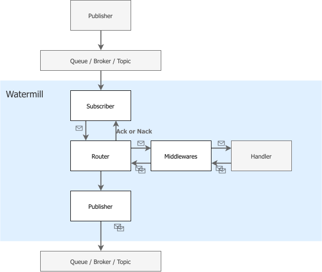

# Watermill Event Driven Architecture

> Watermill是一个用于高效处理消息流的Golang库。它旨在用于构建事件驱动的应用程序。

[reference](https://www.tizi365.com/topic/14661.html)

## 介绍

- Publisher
```go
type Publisher interface {
    Publish(topic string, messages ...*Message) error
    Close() error
}
```

- Subscriber
```go
type Subscriber interface {
    Subscribe(ctx context.Context, topic string) (<-chan *Message, error)
}
```

## 消息组件

> 消息是Watermill的核心部分之一。消息通过“发布者”发布并由“订阅者”接收。当处理消息时，如果处理失败，您应该发送一个Ack()（表示成功处理）或一个Nack()（表示处理失败）。
>
> 消息的Ack和Nack由订阅者进行处理（在默认实现中，订阅者会等待Ack或Nack）。

- Message
```go
type Message struct {
	// UUID是消息的唯一标识符。
	//
	// 它仅用于Watermill进行调试。
	// UUID可以为空。
	UUID string

	// Metadata包含消息的元数据。
	//
	// 可用于存储不需要解码整个有效载荷的数据。
	// 它类似于HTTP请求的标头。
	//
	// Metadata会被编组并保存到PubSub中。
	Metadata Metadata

	// Payload是消息的有效载荷。
	Payload Payload

	// ack在接收到确认时关闭。
	ack chan struct{}
	// noACk在接收到否定确认时关闭。
	noAck chan struct{}

	ackMutex    sync.Mutex
	ackSentType ackType

	ctx context.Context
}
```

- Ack/Nack

> Ack不会阻塞。Ack具有幂等性。如果已经发送了Nack，则返回false。
>
> Nack不会阻塞。Nack具有幂等性。如果已经发送了Ack，则返回false。

```go
select {
	case <-msg.Acked():
		// 确认消息已成功处理。ack在接收到确认时关闭
	case <-msg.Nacked():
		// 确认消息处理失败。noACk在接收到否定确认时关闭。
}
```

## 发布&订阅

- 发布者（Publisher）
```go
type Publisher interface {
    // Publish将提供的消息发布到给定的主题。
    //
    // Publish可以是同步的也可以是异步的-这取决于实现。
    //
    // 大多数发布者的实现不支持原子发布消息。
    // 这意味着如果发布其中一条消息失败，下一条消息将不会被发布。
    //
    // Publish必须是线程安全的。
    Publish(topic string, messages ...*Message) error
    // 如果发布者是异步的，则Close应刷新未发送的消息。
    Close() error
}
```

> - 发布多个消息: 大多数发布者的实现不支持原子发布消息。这意味着如果发布其中一条消息失败，下一条消息将不会被发布。
> - 异步发布: 发布可以是同步的也可以是异步的-这取决于实现。
> - Close(): 如果发布者是异步的，则Close应刷新未发送的消息。别忘记关闭订阅者。否则，您可能会丢失一些消息。

- 订阅者
```go
type Subscriber interface {
    // Subscribe返回具有来自提供的主题的消息的输出通道。
    // 当订阅者被调用Close（）时，通道将关闭。
    //
    //要收到下一条消息，必须对接收到的消息调用`Ack（）`。
    //如果消息处理失败，并且应重新传递消息，应该调用`Nack（）`。
    //
    //当提供的ctx取消时，订阅者将关闭订阅并关闭输出通道。
    //提供的ctx设置为所有生成的消息。
    //当在消息上调用Nack或Ack时，将取消消息的上下文。
    Subscribe(ctx context.Context, topic string) (<-chan *Message, error)
}
```

> - Ack/Nack机制: 订阅者有责任处理来自消息的Ack和Nack。正确的实现应在消耗下一条消息之前等待Ack或Nack。
> - Close(): Close会关闭所有订阅和它们的输出通道，并在需要时刷新偏移等。
> - 至少一次传递: Watermill使用至少一次的传递语义构建。这意味着在处理消息时发生错误并且无法发送Ack时，将重新传递消息。

## 消息路由



- Router
```go
type RouterConfig struct {
	// CloseTimeout 确定在关闭时，路由器应该为处理程序工作的时间。
	CloseTimeout time.Duration
}

func (c *RouterConfig) setDefaults() {
	if c.CloseTimeout == 0 {
		c.CloseTimeout = time.Second * 30
	}
}

// Validate 检查路由器配置是否有错误。
func (c RouterConfig) Validate() error {
	return nil
}
```

- Handler
```go
// HandlerFunc是当接收到消息时调用的函数。

// 在HandlerFunc不返回错误时，将自动调用msg.Ack()。

// 当HandlerFunc返回错误时，将调用msg.Nack()。

// 当处理程序中调用了msg.Ack()并且HandlerFunc返回错误时，

// 将不会发送msg.Nack()，因为已经发送了Ack。

// 当接收到多条消息时(因为在HandlerFunc中发送了msg.Ack()或Subscriber支持多个消费者时)，

// HandlerFunc会并行执行。

type HandlerFunc func(msg *Message) ([]*Message, error)
```

- Router.AddHandler
```go
// AddHandler添加一个新的处理程序。

// handlerName必须是唯一的。目前，它仅用于调试。

// subscribeTopic是处理程序将接收消息的主题。

// publishTopic是处理程序返回的消息将由Router产生的主题。

// 当处理程序需要发布到多个主题时，

// 建议只向处理程序注入Publisher或实现中间件，

// 中间件可以根据元数据捕获消息并发布到特定的主题。

// 如果在路由器已经运行时添加处理程序，则需要显式调用RunHandlers()。

func (r *Router) AddHandler(
	handlerName string,
	subscribeTopic string,
	subscriber Subscriber,
	publishTopic string,
	publisher Publisher,
	handlerFunc HandlerFunc,

) *Handler {

	r.logger.Info("Adding handler", watermill.LogFields{
		"handler_name": handlerName,
		"topic":        subscribeTopic,
	})

	r.handlersLock.Lock()
	defer r.handlersLock.Unlock()

	if _, ok := r.handlers[handlerName]; ok {
		panic(DuplicateHandlerNameError{handlerName})
	}

	publisherName, subscriberName := internal.StructName(publisher), internal.StructName(subscriber)

	newHandler := &handler{
		name:   handlerName,
		logger: r.logger,
		subscriber:     subscriber,
		subscribeTopic: subscribeTopic,
		subscriberName: subscriberName,
		publisher:     publisher,
		publishTopic:  publishTopic,
		publisherName: publisherName,
		handlerFunc: handlerFunc,
		runningHandlersWg:     r.runningHandlersWg,
		runningHandlersWgLock: r.runningHandlersWgLock,
		messagesCh:     nil,
		routersCloseCh: r.closingInProgressCh,
		startedCh: make(chan struct{}),
	}

	r.handlersWg.Add(1)
	r.handlers[handlerName] = newHandler

	select {
	case r.handlerAdded struct{}{}:
	default:
		// closeWhenAllHandlersStopped is not always waiting for handlerAdded
	}

	return &Handler{
		router:  r,
		handler: newHandler,
	}
}

// AddNoPublisherHandler添加一个新的处理程序。

// 这个处理程序不能返回消息。

// 当返回消息时，会发生错误并发送Nack。

//

// handlerName必须是唯一的。目前，它仅用于调试。

// subscribeTopic是处理程序将接收消息的主题。

// subscriber是一个订阅者，用于消费消息。

// 如果在路由器已经运行时添加处理程序，则需要显式调用RunHandlers()。

func (r *Router) AddNoPublisherHandler(
	handlerName string,
	subscribeTopic string,
	subscriber Subscriber,
	handlerFunc NoPublishHandlerFunc,
) *Handler 

handlerFuncAdapter := func(msg *Message) ([]*Message, error) {}
// ...
```

- 无发布处理程序
> 并非每个处理程序都会生成新消息。您可以使用 Router.AddNoPublisherHandler 来添加此类型的处理程序
```go
// ...
// AddNoPublisherHandler 添加一个新的处理程序。
// 该处理程序不能返回消息。
// 当返回消息时，将发生错误并发送 Nack。
//
// handlerName 必须是唯一的。目前，之仅用于调试目的。
//
// subscribeTopic 是处理程序将接收消息的主题。
//
// subscriber 是将使用的 Subscriber 消费消息。
//
// 如果在路由器已经运行时添加处理程序，则需要显式调用 RunHandlers()。
func (r *Router) AddNoPublisherHandler(
	handlerName string,
	subscribeTopic string,
	subscriber Subscriber,
	handlerFunc NoPublishHandlerFunc,
) *Handler {
	handlerFuncAdapter := func(msg *Message) ([]*Message, error) {}
// ...
}
```

